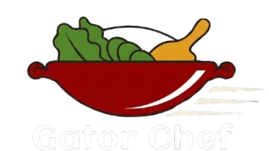
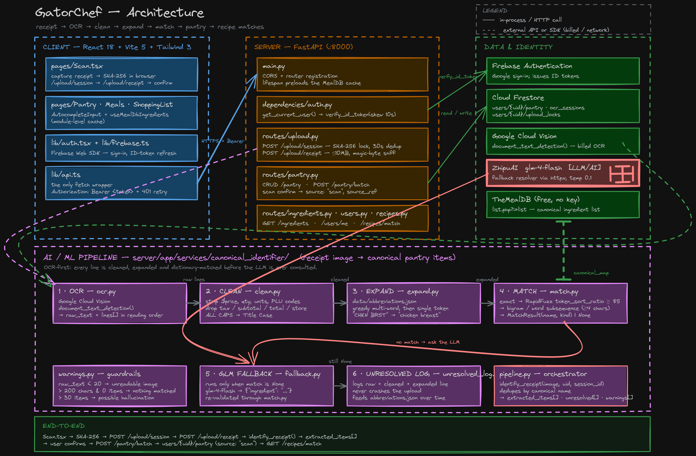
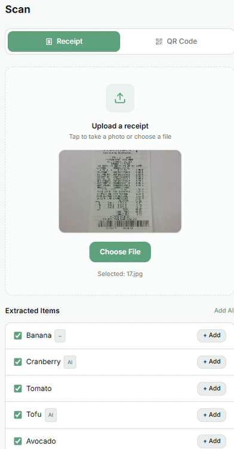

<p align="center">
  
</p>

<h1 align="center">GatorChef</h1>

<p align="center"><strong>Recipes for the discerning student.</strong></p>

<p align="center">
  Scan a receipt. Get meals you can actually cook tonight, from food you already own.
</p>

<p align="center">
  
  
  
  
  
  
</p>

---

<p align="center">
  
</p>

<p align="center"><sub>Editable source: <a href="docs/architecture.excalidraw"><code>docs/architecture.excalidraw</code></a> (open at excalidraw.com)</sub></p>

## Project Vision

Using the Geoffrey Moore product vision template:

**For:** new college students transitioning to independent living

**Who:** struggle with meal planning, grocery budgeting, and maintaining consistent eating habits during high-stress academic transitions

**The:** GatorChef

**Is a:** meal planning and grocery management tool

**That:** converts receipts or pantry lists into quick, low-cost meal options with an automatic shopping list, helping students build sustainable eating habits that support their energy and academic performance

**Unlike:** generic meal planning apps that assume cooking experience, stable routines, and flexible budgets

**Our product:** is designed around student constraints including minimal time, tight budgets, and limited pantry inventory, turning what a student already has into actionable meals

## The Problem

College students face a real gap between having access to food and knowing how to consistently turn groceries into affordable meals. They have no experience planning meals or budgeting groceries, no time to think about food during demanding academic schedules, no money to waste on unnecessary groceries, and no guidance from tools built for student life.

The result is skipped meals, wasted groceries, poor nutrition, and lower energy — exactly when academic performance matters most. Existing meal planning apps assume stable routines, flexible budgets, and cooking confidence that many students simply do not have.

## The Solution

GatorChef starts from what a student already owns instead of from a blank slate.

1. **Scan a receipt** — or add pantry items by hand with autocomplete
2. **Identify ingredients** — OCR reads the receipt; the pipeline maps messy retail text to real ingredient names
3. **Confirm** — you approve what goes into your pantry, so nothing lands there by surprise
4. **Match meals** — recipes are ranked by how much of them you can already make
5. **Fill the gaps** — a shopping list is generated for whatever is missing

## How the ingredient identifier works

This is the part that makes GatorChef more than CRUD. A receipt does not say `chicken breast`. It says `2 / $7.98 BNLS CHKN` or `QUAKER SQUARES CEREAL 4.29 F`. Turning that into something a recipe engine understands is the actual problem.

<p align="center">
  
</p>

**The pipeline is OCR-first, not LLM-first.** Every line is cleaned, expanded, and dictionary-matched before a language model is ever consulted:

| Stage | Module | What it does |
| --- | --- | --- |
| 1 · OCR | `ocr.py` | Google Cloud Vision `document_text_detection()` → raw lines in reading order |
| 2 · Clean | `clean.py` | strips prices, weights, PLU codes, quantity prefixes; drops tax/subtotal/store lines; ALL CAPS → Title Case |
| 3 · Expand | `expand.py` | 342-entry `abbreviations.json`; multi-word phrases first, so `CHKN BRST` expands as one unit |
| 4 · Match | `match.py` | exact lookup → RapidFuzz `token_sort_ratio` ≥ 85 → bigram/word subsequence |
| 5 · Fallback | `fallback.py` | only when matching returns nothing: `glm-4-flash` names the likely ingredient |
| 6 · Log | `unresolved_log.py` | anything still unresolved is logged and becomes tomorrow's abbreviation entry |

**The LLM cannot lie its way into your pantry.** The fallback's answer is not trusted — it re-enters `match.py` and must resolve to a real MealDB ingredient to survive. If it doesn't, it's discarded and logged. Every extracted item carries the `match_kind` that produced it, which is what the `AI` and `~` badges in the screenshot above are showing — you can always see *how* an item was identified before you accept it.

The unresolved log closes the loop: real failures from real receipts are what grow the abbreviation table, rather than guesses about what abbreviations might exist.

## Key Features

- receipt scanning with canonical ingredient extraction
- confirm-before-write: scanned items only reach the pantry once you approve them
- pantry CRUD with autocomplete backed by the MealDB ingredient list
- meal recommendations ranked by ingredient overlap
- automatic shopping list for missing ingredients
- Firebase Auth with server-side ID token verification
- per-user pantry and profile storage in Firestore
- duplicate-upload protection and structured warnings for unreadable images

## Tech Stack

| Layer | Stack |
| --- | --- |
| **Frontend** | React 18 · TypeScript · Vite 5 · Tailwind 3 · Radix/shadcn · React Query · React Router 6 |
| **Backend** | Python · FastAPI · Pydantic v2 · httpx |
| **Data & auth** | Firebase Firestore · Firebase Auth |
| **AI / OCR** | Google Cloud Vision · RapidFuzz · ZhipuAI `glm-4-flash` |
| **External** | TheMealDB (ingredient + recipe data) |
| **Tooling** | Docker · Vitest · Playwright · ESLint |

Interactive API docs are available at `http://127.0.0.1:8000/docs` once the backend is running.

## Project Structure

```text
GatorChef/
├── client/                          React 18 + Vite SPA
│   └── src/
│       ├── pages/                   Scan · Pantry · Meals · RecipeDetail · ShoppingList · Profile · Login
│       ├── components/              shared UI (components/ui/ = shadcn/Radix primitives)
│       ├── hooks/                   useMealDbIngredients (module-level cache)
│       └── lib/                     api.ts — the only fetch wrapper · auth.tsx · firebase.ts
│
├── server/                          FastAPI backend
│   └── app/
│       ├── main.py                  app factory, CORS, routers, MealDB cache preload
│       ├── routes/                  pantry · upload · ingredients · users · recipes
│       ├── services/
│       │   ├── canonical_identifier/    ← the OCR pipeline
│       │   │   ├── pipeline.py          orchestrator: identify_receipt()
│       │   │   ├── ocr.py               Google Cloud Vision
│       │   │   ├── clean.py             token cleaning
│       │   │   ├── expand.py            abbreviation expansion
│       │   │   ├── match.py             exact → fuzzy → subsequence matching
│       │   │   ├── fallback.py          GLM fallback (re-validated)
│       │   │   ├── unresolved_log.py    feedback loop
│       │   │   └── warnings.py          bad-upload heuristics
│       │   └── ingredient_loader.py     cached MealDB ingredient list
│       ├── schemas/                 Pydantic Base/Create/Update/Response per domain
│       ├── dependencies/auth.py     get_current_user → verify_id_token
│       ├── clients/                 firestore_client.py — the only firebase_admin init
│       └── data/abbreviations.json  342 grocery abbreviations
│
├── docs/                            architecture diagram + design docs
├── docker/ · docker-compose.yml     containerization
└── secret/                          gitignored service account keys
```

## Getting Started

### 1. Install dependencies

Frontend:

```bash
cd client
npm install
```

Backend:

```bash
cd server
python -m pip install -r requirements.txt
```

### 2. Configure frontend env

Create `client/.env.local` from `client/.env.example` and fill in Firebase web app values:

- `VITE_API_BASE_URL` (usually `http://127.0.0.1:8000`)
- `VITE_FIREBASE_API_KEY`
- `VITE_FIREBASE_AUTH_DOMAIN`
- `VITE_FIREBASE_PROJECT_ID`
- `VITE_FIREBASE_STORAGE_BUCKET`
- `VITE_FIREBASE_MESSAGING_SENDER_ID`
- `VITE_FIREBASE_APP_ID`

### 3. Configure backend Firebase credentials

Provide a Firebase service account key for backend verification and Firestore access.

Option A (easiest):

- place key at `secret/<your-key>.json` in repo root

Option B:

- set `GOOGLE_APPLICATION_CREDENTIALS` to the key path

Do not commit service account keys or `.env.local`.

### 4. Configure OCR

Receipt scanning uses Google Cloud Vision and reads the same `GOOGLE_APPLICATION_CREDENTIALS` credential. Without it the backend still runs — `/upload/receipt` returns a clean 503 instead of failing at startup.

The GLM fallback is optional: set `ZHIPU_API_KEY`, or point `GLM_OCR_CONFIG` at a config YAML. With no key the pipeline simply skips the fallback rather than erroring.

### 5. Run the app

Backend:

```bash
cd server
python run.py
```

Frontend:

```bash
cd client
npm run dev
```

`python run.py` is a simple wrapper around uvicorn with reload enabled.

### 6. Run the frontend in Docker

Start the Vite dev server in Docker:

```bash
docker compose up --build
```

That currently runs the `client` service only and publishes the app on `http://localhost:8080`.

Notes:

- the compose setup is dev-focused for now
- source code is bind-mounted into the container for live editing
- `client/.env.local` is still the right place for local frontend secrets and Firebase config
- the backend is not containerized yet, but `docker-compose.yml` is ready to grow into a multi-service setup

### 7. Build a production frontend image

The client Dockerfile also has a production target that serves the built app with nginx:

```bash
docker build -t gatorchef-client --target prod ./client
docker run --rm -p 8080:80 gatorchef-client
```

### 8. Quick checks

- backend health: `http://127.0.0.1:8000/health`
- frontend dev server: URL printed by Vite

## Documentation

| Doc | What's in it |
| --- | --- |
| [`docs/architecture.excalidraw`](docs/architecture.excalidraw) | the diagram above, editable |
| [`v2-ocr_feature_objectives.md`](v2-ocr_feature_objectives.md) | the OCR-first pipeline: design decisions, success criteria, why the LLM is a fallback |
| [`architectural_patterns.md`](architectural_patterns.md) | routing/service/auth patterns, schema layering, Firestore schema |
| [`fastapi_layer.md`](fastapi_layer.md) | server layout and request lifecycle |
| [`dependencies.md`](dependencies.md) | why each runtime dependency is here |

## Why GatorChef Matters

GatorChef addresses a practical student-life problem that affects health, budget, and academic consistency. By turning what students already have into actionable meals, the app lowers day-to-day friction and helps build better food habits over time.
